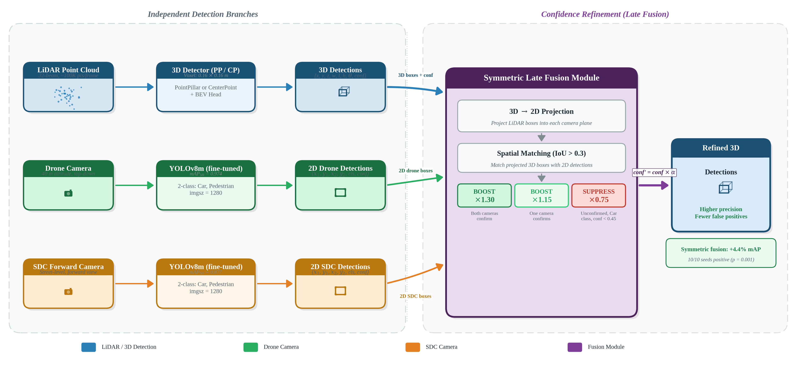
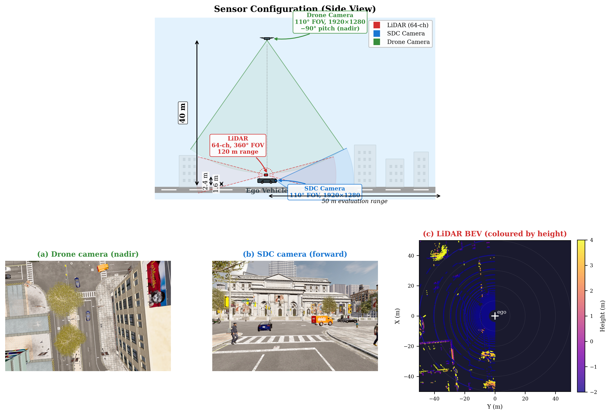
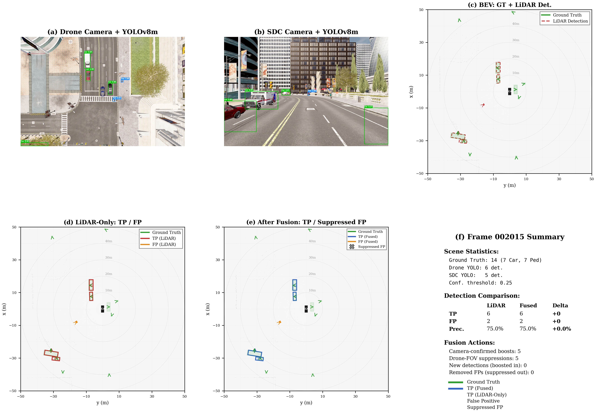
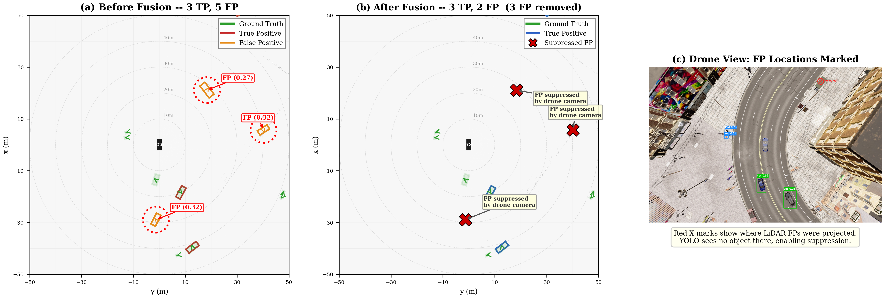
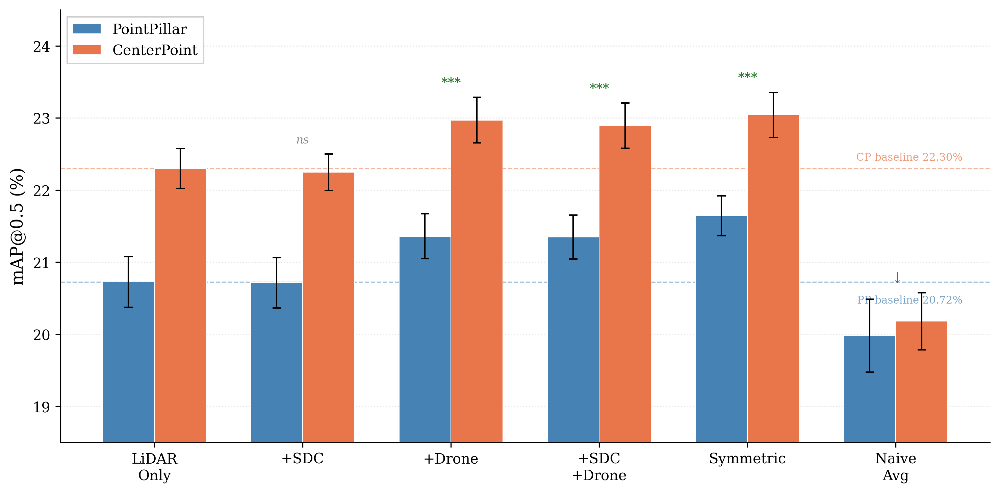
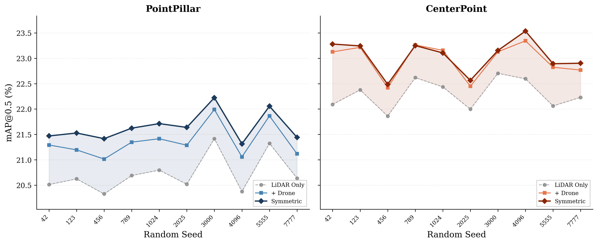
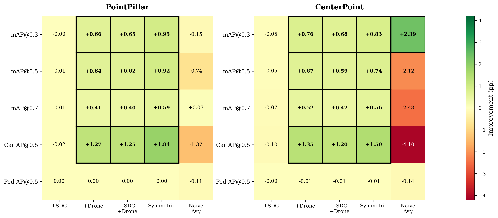

# Dual-Camera LiDAR Fusion for Occlusion-Robust 3D Detection

> **Paper:** *Dual-Camera LiDAR Fusion for Occlusion-Robust 3D Detection in Urban Driving Simulation*
> **Authors:** Xingnan Zhou, Ciprian Alecsandru
> **Affiliation:** Concordia University, Montreal, QC, Canada
> **Status:** Submitted to MDPI *Sustainability* (2026)
> **Project Page:** [obsicat.com/bev-lidar-fusion.html](https://obsicat.com/bev-lidar-fusion.html)

<p align="center">
  
</p>

---

## Highlights

- **Symmetric dual-camera late fusion** combining a drone camera (40 m altitude) with a forward-facing dashboard camera to augment LiDAR-based 3D object detection
- **PointPillar:** +0.92 pp mAP@0.5 (+4.4% relative), 10/10 seeds positive (*p* = 0.001)
- **CenterPoint:** +0.74 pp mAP@0.5 (+3.3% relative), 10/10 seeds positive (*p* = 0.001)
- **Primary mechanism:** false-positive suppression (&#8722;13% FP rate)
- **Detector-agnostic:** consistent gains across both PointPillar and CenterPoint architectures

---

## Key Results

### PointPillar (10-seed average)

| Configuration | Car AP@0.5 | Ped AP@0.5 | mAP@0.5 | Delta | *p*-value |
|:---|:---:|:---:|:---:|:---:|:---:|
| LiDAR-only | 38.50 | 2.69 | 20.76 &plusmn; 0.38 | -- | -- |
| + Drone | 40.21 | 2.57 | 21.39 &plusmn; 0.35 | +0.63 | 0.001 |
| **+ Symmetric** | **40.74** | **2.61** | **21.68 &plusmn; 0.31** | **+0.92** | **0.001** |

### CenterPoint (10-seed average)

| Configuration | Car AP@0.5 | Ped AP@0.5 | mAP@0.5 | Delta | *p*-value |
|:---|:---:|:---:|:---:|:---:|:---:|
| LiDAR-only | 39.04 | 5.56 | 22.30 &plusmn; 0.28 | -- | -- |
| + Drone | 40.39 | 5.55 | 22.97 &plusmn; 0.32 | +0.67 | 0.001 |
| **+ Symmetric** | **40.54** | **5.54** | **23.04 &plusmn; 0.31** | **+0.74** | **0.001** |

---

## Method

<p align="center">
  
</p>
<p align="center"><em>Sensor layout: 64-channel LiDAR, forward-facing camera, and drone camera at 40 m altitude.</em></p>

The method follows a three-stage pipeline:

1. **3D LiDAR Detection** -- PointPillar or CenterPoint processes the 64-channel LiDAR point cloud to produce initial 3D bounding box proposals.
2. **2D Camera Detection** -- Two YOLOv8m models, independently fine-tuned on CARLA imagery, detect objects in the drone and forward camera views.
3. **Symmetric Late Fusion** -- Camera-confirmed LiDAR detections receive a confidence boost (x1.15 single-camera, x1.30 dual-camera), while unconfirmed detections in high-visibility zones are suppressed (x0.75). The fusion is class-aware: suppression applies only to vehicles, preserving pedestrian recall.

### Why late fusion?

Late fusion preserves the modularity of each detector, enabling straightforward upgrades (e.g., swapping PointPillar for CenterPoint) without retraining the full pipeline. It also avoids the calibration brittleness of early and mid-level fusion approaches.

---

## Dataset

| Property | Value |
|:---|:---|
| Simulator | CARLA 0.9.15, Town10HD |
| Frames | 2,600 |
| Annotations | 35,837 (25,625 Car + 10,212 Pedestrian) |
| LiDAR | 64-channel, 120 m range |
| Cameras | Forward (1920 x 1280) + Drone at 40 m (1920 x 1280) |
| Validation | 10-seed repeated random sub-sampling (80/20 split) |

Data was collected using `scripts/collect_dual_camera_lidar.py`, which orchestrates CARLA to simultaneously capture synchronized LiDAR sweeps, camera images, and 3D ground-truth annotations.

---

## Qualitative Results

<p align="center">
  
</p>
<p align="center"><em>Top: LiDAR-only detections. Bottom: After symmetric fusion. Green = true positives, red = false positives.</em></p>

<p align="center">
  
</p>
<p align="center"><em>False-positive suppression in action: unconfirmed LiDAR detections in the drone's field of view are suppressed, removing ghost detections.</em></p>

### Ablation and Per-Seed Analysis

<p align="center">
  
  &nbsp;
  
</p>
<p align="center"><em>Left: Ablation across fusion configurations. Right: Per-seed mAP@0.5 showing consistent improvement across all 10 seeds.</em></p>

<p align="center">
  
</p>
<p align="center"><em>Heatmap of mAP improvement across fusion configurations and evaluation metrics.</em></p>

---

## Repository Structure

```
dual-camera-lidar-fusion/
├── configs/                          # OpenPCDet model configurations
│   ├── carla_dataset.yaml            #   CARLA dataset definition
│   ├── pointpillar.yaml              #   PointPillar architecture config
│   └── centerpoint.yaml              #   CenterPoint architecture config
├── figures/                          # Paper figures (PNG)
├── paper/                            # LaTeX source
│   ├── main.tex
│   └── references.bib
├── scripts/
│   ├── collect_dual_camera_lidar.py  # CARLA data collection pipeline
│   ├── generate_yolo_labels.py       # 3D GT → YOLO 2D label projection
│   ├── train_yolo_carla.py           # YOLOv8m fine-tuning on CARLA
│   ├── evaluate_fusion.py            # Main fusion evaluation pipeline
│   ├── triple_view_fusion.py         # Core fusion logic (boost/suppress)
│   ├── parameter_sensitivity.py      # Sensitivity analysis
│   └── visualize_bev.py              # BEV visualization
├── README.md
├── LICENSE                           # MIT License
└── requirements.txt
```

---

## Getting Started

### Prerequisites

- Python 3.8+
- CUDA 11.x or 12.x
- [CARLA 0.9.15](https://carla.org/) (for data collection only)

### Installation

```bash
git clone https://github.com/Jynxzzz/dual-camera-lidar-fusion.git
cd dual-camera-lidar-fusion
pip install -r requirements.txt
```

You will also need [OpenPCDet](https://github.com/open-mmlab/OpenPCDet) v0.6.0 installed separately for 3D detection training and inference.

### Workflow

1. **Collect data** (requires CARLA running):
   ```bash
   python scripts/collect_dual_camera_lidar.py --town Town10HD --frames 2600
   ```

2. **Generate YOLO labels** from 3D ground truth:
   ```bash
   python scripts/generate_yolo_labels.py --data_root /path/to/collected/data
   ```

3. **Fine-tune YOLOv8m** on CARLA camera images:
   ```bash
   python scripts/train_yolo_carla.py --camera sdc --epochs 50
   python scripts/train_yolo_carla.py --camera drone --epochs 50
   ```

4. **Train 3D detector** (PointPillar or CenterPoint via OpenPCDet):
   ```bash
   cd /path/to/OpenPCDet/tools
   python train.py --cfg_file /path/to/configs/pointpillar.yaml
   ```

5. **Run fusion evaluation**:
   ```bash
   python scripts/evaluate_fusion.py \
       --checkpoint /path/to/pointpillar.pth \
       --yolo_sdc /path/to/yolo_sdc/best.pt \
       --yolo_drone /path/to/yolo_drone/best.pt
   ```

6. **Visualize BEV results**:
   ```bash
   python scripts/visualize_bev.py --frame_id 100
   ```

---

## Dependencies

| Component | Version | Role |
|:---|:---|:---|
| [OpenPCDet](https://github.com/open-mmlab/OpenPCDet) | 0.6.0 | 3D object detection (PointPillar, CenterPoint) |
| [Ultralytics YOLOv8](https://github.com/ultralytics/ultralytics) | 8.0+ | 2D camera object detection |
| [CARLA Simulator](https://carla.org/) | 0.9.15 | Synthetic data generation |
| [PyTorch](https://pytorch.org/) | 1.10+ | Deep learning framework |

---

## Citation

If you find this work useful, please cite:

```bibtex
@article{zhou2026dualcamera,
  title   = {Dual-Camera LiDAR Fusion for Occlusion-Robust 3D Detection
             in Urban Driving Simulation},
  author  = {Zhou, Xingnan and Alecsandru, Ciprian},
  journal = {Sustainability},
  year    = {2026},
  publisher = {MDPI}
}
```

---

## License

This project is licensed under the [MIT License](LICENSE).
